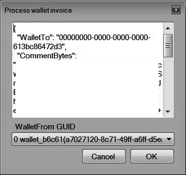
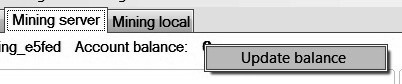

[TOC]

---

##Overview

BitMoney is a payment system for on-line services with fast, cheap and secure transactions. It's based on own minable digital currency (__BTM__ symbol).

###Main features

* No personal info required. Just download the client application and use.
* Centralized emission and payments processing.
* Solo POW CPU-oriented mining with constant complexity.
* 1 BTM production cost ~ 1 minute of 4 core CPU computations.
* Fast and cheap transactions with encrypted notes (0.01% + 1 BTM for now).
* Anonymous (for clients) transfers optionally.
* Unlimited total supply of coins.
* Built-in message service with 100% SPAM protection.
* Built-in exchange (with Bitcoin for now).

###Technical details

* Portable standalone cross-platform full managed .NET desktop GUI application (runs on every system where .NET Framework 4.5.0 or Mono are presented, Linux compatible).
* Small storage requirements
* Ready to work immediately after start.
* Client-server protocols based on the i2p network, most experienced system for anonymous and encrypted communication.
* Client authentication and encryption key exchange based on RSA with 2048 bit keys. Everything including local settings is encrypted with AES-256.
* Easy integration with your services and applications via invoices and JSON-RPC 2.0 API.
* Scrypt 32 MB RAM mining algorithm (N=2<sup>15</sup> R=8 P=1). Possibly will be changed in the future.
* Built-in native CPU miner both for Windows and Linux.

###Contacts

* Our site and forum in i2p <http://bitmoney.i2p>.
* <http://forum.i2p/viewtopic.php?t=11980> topic on official i2p forum.
* \#bitmoney channel in i2p IRC.

##Getting started

###Launch i2p network

Application requires running i2p router (background daemon to get everything work). It'll take you 5-10 minutes to install. 

Get the last version of i2p router from <https://geti2p.net/en/download> and set it up properly.

Launch i2p router and open its console (usually it has <http://127.0.0.1:7657> address) in your favorite web browser. Wait for a few minutes to get it started. If you see at the left panel some status different from "Network: OK" then something goes wrong. 

(Optional) The most common problem is firewalled ports. It's not crucial but highly recommended to forward ports manually then. Required port number can be found at <http://127.0.0.1:7657/confignet> page. On other errors please use i2p documentation to resolve.

(Optional) Default memory limit (128Mb) for java process is often not enough too, causing unexpected crashes. Change it to 256Mb or even 512Mb <https://geti2p.net/en/faq> (the setting __wrapper.java.maxmemory__ in the file __wrapper.conf__, location depends on OS) and stop\start i2p router (not **Restart** button in i2p router console but __service restart__ in Ubuntu or in Windows Service).

I2p router will be ready for work when you'll see the “OK” network status and “Accepting tunnels” above the “Local tunnels” section

Then in “I2P services” tab <http://127.0.0.1:7657/configclients> for “SAM application bridge” check “Run at startup” and click the "Start" button. Then click the “Save Client Configuration” button. Remember the IPv4 address and port of SAM (default values are '127.0.0.1' and '7656') from "Class and arguments" column.

That's it. To browse internal i2p sites (including <http://bitmoney.i2p>) you have to set your browser proxy as 
'127.0.0.1:4444'. More info <https://geti2p.net/en/about/browser-config>.


###Download files

Get the client archive (.zip) from clearnet links or via I2pSnark (preferable) by adding the magnet links to <http://127.0.0.1:7657/i2psnark>. They both can be found on <http://bitmoney.i2p/downloads.html>. Then extract the archive to any folder. The application should have rights to write and change any file in this folder and sub folders so don't extract it to any protected folder ('Program files' in Windows OS for example). BitMoney GUI is a portable application, OS installation isn't required.

If your system doesn't have a .NET or Mono, please download and install it first. .NET Framework 4.5.0 is required. Tested on Ubuntu 14.04 with Mono 4.0.4, worked fine too. There were accident crashes with Mono 4.0.1 so please use the latest Mono version possible (<http://www.mono-project.com/docs/getting-started/install/linux/> help, __mono-complete__ package).

###First start and private common settings password

Run __BitMoneyClient.exe__ (or **chmod +x ./run_on_mono.sh && ./run_on_mono.sh** if Mono is used) executive file to start the program. 

Starting BitMoney client for the first time, you will be asked to set a private common setting's password. Private common settings contains general BitMoney GUI application settings which should not be revealed, default location is './Settings/PrivateCommonSettings.aes256'.

Keep your private common setting's password. If you'll lose the password, you __don’t__ lose the access to your message\wallet\exchange\mining accounts, only common info like i2p address\rpc credentials\etc. But some information there like private i2p destination is highly important for secure communication with BitMoney servers, so:

In the case of lost or compromised private common settings just delete the file ‘PrivateCommonSettins.aes256’ from the client program folder to generate new. On the next program launching you will be able to choose a new password.

Any Unicode symbols can be used as password characters.

After client program starts, you will be asked to enter common settings password 

.

If your network settings are correct and the password you have entered is right then the client will try connect to the BitMoney's servers and you'll see something like <span style="color:green;">I2p destination balance 15.0</span> in the lower left corner. Now you can register clients and use wallets\messaging\mining\exchange services.

##General actions and settings

###Client I2P settings

Client I2P settings allow setting up parameters of the client i2p connection.

To open I2P settings use the main menu button Menu >> Proxy >> I2P settings 

. 

In the opened window you can change 

:

* Sam server IP address (remembered from SAM bridge)
* Sam server port (same)
* Client I2P keys (very important not to share it anywhere, authentication protocol uses the address for client identification). It's empty on start and fills automatically with the first connection.

Also in this window you can set up the client account minimum balance for fill. 

Use the ‘Auto fill’ check box to fill the client account balance automatically by mining when its value becomes less than ‘Min balance for fill’. Look below for more details about i2p destination balance. 

###Client i2p destination balance

Every client i2p destination (internal i2p address) has own balance in BTM on BitMoney's 'proxy' servers (CDN-like structure), which is not associated with another balances of wallets, message or mining accounts and is used to pay for keeping connection with the server, for all types of account registration and for every other actions. Take care about auto-fill option enabled or enough balance to stay on-line for a long time.

The balance amount displayed in the left lower corner of the client window [illustration](#illustration9).

<a name="illustration9"></a>

You can set up the client account balance auto refill with the built-in miner (which is not associated with the main mining accounts). To set up the minimum balance for auto fill, click the main menu button Menu >> Proxy >> I2P settings.

Client account balance may also be replenished by direct transfer from your wallet [illustration](#illustration9).

Click the right button on the balance and choose ‘Issue invoice to refill’. In the window appeared, enter the amount you want to pay [illustration](#illustration10). 

<a name="illustration10"></a>

To process wallet invoice your wallet must be logged in ([illustration](#illustration11)). After the payment acceptation, your proxy server balance will be refilled from your wallet account balance.

<a name="illustration11"></a>

You should keep a minimum amount of balance to do various operations without unexpected errors.

You can see some types of operations and the required minimum of the balance below. 

* Connect to * server - 7
* Register * account - 5
* Update client - 7

Generally, the auto refill option is enough to keep your balance normal. It is recommended to set up the auto fill balance option ([Illustration](#illustration4)).

<span style="color:red;">Important note:</span> There is a limit for proxy server balance, for now it's 100000, don't try to fill the balance higher.

###Profile types

Profile is a set of data to access internal services, usually it contains at least private RSA keys for authentication.

4 client profile types:

* _wallet_
* _mining_
* _exchange_
* _messages_

4 password types: 

* _Private common setting's password_ to access the common client settings (JSON-RPC servers parameters, i2p private keys, etc).
* _Profile and certificate passwords_ for wallet, messages, exchange and mining accounts, different for every type of account, provide main access to account functions.
* Additional _Master certificate password_ for additional wallet and messages accounts protection, different for every type of account, designed mostly for the future (account locking, change important settings on server, etc). 

####Profiles backup
To restore the access to account you should have encrypted profile file and profile\cert passwords. Profile files can be found in __./Settings/(Message|MiningClient|Wallet|Exchange)Profiles/*.aes256__ directory. Just copy them to another machine to correspondent folder.

###Local mining settings
To open the local mining settings use Menu >> Local mining >> Local mining settings.

In this window you can set up:

* Current task count.
* To use native libs or not (recommended, 5 times faster than managed code).
* Threads per task.
* To use internal or external solver. 


General recommendation is to set task count = 1 and threads count = core number of your CPU.

###External solver

You can use external solver for mining. The solver should parse command line arguments, solve mining task and write serialized solution to selected folder. Please download and look at _ExternalSolverExample_ project in _Downloads_ section on our site.

###GUI appearance settings

You can change global font size by manually editing __./Settings/PublicCommonSettings.json__ (__FontSizePt__ parameter, default is 9.0). 

###Check for updates

Sometimes you will receive a proposal to update the client from the server. On your remote machines please use the proxy API (look further) to check is new version available.

<span style="color:red;">You should upgrade as fast as it's possible cause requests to internal servers (mining, wallet, message, exchange) are rejected from the old clients.</span>

However, you may check for updates by yourself. To check for updates, use the main menu button Menu >> Check for updates [Illustration](#illustration7).

<a name="illustration7"></a>

If there are available updates on the server then downloading starts. After it's finished, GUI will be closed without confirmation (so logout and close external application before update process started). After the end of update GUI will be started again.

Otherwise, you'll get the message if the system recognizes that you have the last version [illustration](#illustration8).

<a name="illustration8"></a>

##Wallets

BitMoney system uses wallets for making payments. 

Wallet address has GUID or UUID format ("00000000-0000-0000-0000-000000000000"). Starting from version 0.0.4 wallet address contains Scrypt hash of your public keys for authenticity verification.

Both transfer amount and wallet balance are 64 bit integers.

###New wallet registration

To register a new wallet click the main menu button Wallet >> Register new.

Type 3 passwords for different security levels of wallet account access ([illustration](#illustration12)). Any Unicode symbols can be used as a password characters. Don’t lose your passwords; otherwise, you lose the access to wallet account irrevocably.

<a name="illustration12"></a>

After the server receives your registration data, process of registration starts ([illustration](#illustration13)). When the registration process successfully completed, you'll get the message about new wallet registration. 

<a name="illustration13"></a>

###Wallet login 

To login with your wallet click the main menu button Wallet >> Login.

Select wallet profile if you have several wallets. Enter 2 passwords one by one (profile file password, wallet certificate password). Then the wallet server connection process starts ([illustration](#illustration14)).

<a name="illustration14"></a>

The wallet is logged in, if you see its account information in the ‘Wallets’ tab page ([illustration](#illustration15)).

<a name="illustration15"></a>

###Change wallet password

To change wallet passwords click the main menu button Wallet >> Change password.

Choose the password type you want to change ([illustration](#illustration16)).

<a name="illustration16"></a>

Enter the old profile file password before you choose the new one. 

If you change the wallet cert password, you also will be asked for the old wallet cert password. 

If you change the master wallet cert password, you also will be asked for the old master wallet cert password.

###Wallet window information

The wallet window contains the main wallet and payments information ([illustration](#illustration17)).

<a name="illustration17"></a>

The logged in wallet information the wallet name, balance and GUID.

Click the right mouse button on the logged in wallet information string to see available actions with the wallet. Look details about these capabilities in paragraph 5 ‘Payments’.

The ‘Recent transfers’ window contains detailed information about transfers done before. Last 100 transactions are shown here.

##Payments

To send or receive payments via BitMoney one or more of your wallets must be logged in.

###Receive funds

To receive some funds, you need to know own wallet GUID. To copy your wallet GUID click the right button on the wallet account information row. Click the ‘Copy wallet GUID’ item ([illustration](#illustration24)). It'll be pasted to clipboard, now you can pass it to the future sender.

<a name="illustration24"></a>

###Making payments

####Send funds to another wallet

To make a payment, right click the wallet account row. Choose the ‘Send funds’ item ([illustration](#illustration25)).

<a name="illustration25"></a>

Input transfer amount and receiver wallet GUID in the opened ‘Send Funds’ window ([illustration](#illustration26)).

You can input a text note that will be sent to your receiver with a payment. If the checkbox ‘Base64’ is activated, the payment comment will be parsed from base64 representation, otherwise UTF8 string binary representations will be used.

Fee formula for now:

__Fee = 1 + round(0.0001 * TransferAmount) + floor(1 * CommentSizeKb)__

A payment may be turned into invoice (look further). To make an invoice, input the correct data into the ‘Send Funds’ form, then click the button ‘To invoice’.

<a name="illustration26"></a>

####Anonymous transfers

To make your payment anonymous for recipient, check the ‘Anonymous transfer’ check box in the ‘Send Funds’ form ([illustration](#illustration27)). 

<a name="illustration27"></a>

Anonymous payment means, that the payment receiver will not know the senders' wallet GUID (wallet "from" will be equal to "00000000-0000-0000-0000-0000000001"). Payments from an anonymous sender have an _italic font_ in "Recent transfers" and ([illustration](#illustration28)).

<a name="illustration28"></a>

####Wallet settings on server

The option allows setting up a minimum amount of payments that are accepted (Illustrations [1](#illustration29), [2](#illustration30)). Receiving payments with a less amount will be prohibited. May be used as a spam protection tool in the future.

<a name="illustration29"></a>

<a name="illustration30"></a>

####Payment authentications

Starting from version 0.0.4.* wallet GUID contains public key hash, symmetric session keys and transfer details (except anonymous transfers) are digitally signed. So after receiving Wallet GUID from a trusted source (merchant site, IM, etc) you may rest assured about the payment details authenticity.

<a name="illustration301"></a>

####Process invoice

Invoice is BitMoney payment details in JSON format utilized in easy and fast seller\buyer communication. Seller generate invoice with next fields:

1. WalletTo – seller wallet GUID
2. CommentBytes – base64 string of transfer comment bytes, 64000 bytes max
3. TransferAmount – transfer amount, integer 64 bit type
4. ForceAnonymousTransfer – use anonymous transfer (buyer wallet GUID will not be shown to seller). True\false

Seller sends invoice text representation to buyer. Then buyer clicks Wallet >> 'Process invoice', pastes invoice, selects wallet with proper amount on balance (login first), redirected to 'Send funds' form with filled fields for payment confirmation.

###External payment processor settings

If you want to send any payment details of new transfers to external application, this option should be used. Please look at _ExternalPaymentProcessorExample_ project in _Downloads_ tab. Works for any logged wallets.

<a name="illustration31"></a>

Another option is to use JSON-RPC servers (look further) to fetch transfer details.

###Full transfer history

Full transfer history is a service to search old payments.

Payment details are keeping without the time limitation on BitMoney servers, in the future it'll be limited to several months.

Clicking 'Full transfer history' context menu item of wallet row ([illustration](#illustration32)), you can see the ‘Full transfer history’ window ([illustration](#illustration33)).

<a name="illustration32"></a>

First you should download all transfers in selected time range. Select from\to date, then click 'Get data' button. After downloading you can sort the data by columns and filter them by next options:

* Transfers date and time (from one date, until another date)
* payments direction (sent, received, both)
* specific wallet GUID of sender and receiver
* specific amount of payments
* specific content of comments (only where comment is a valid utf8 string)
* is the payment anonymous or not

After you set up necessary parameters, click the ‘Update’ button to filter data.

<a name="illustration33"></a>

##Mining

Mining ability is integrated within the client. Mining is the only way to produce BitMoney internal currency. BTM you mined will be stored on the mining account balance. Currently 1 BitMoney costs approximately 1 minute of modern 4 core Intel Core i7 work with built-in miner (native miners are very welcome here).

###Mining account registration

To register new mining account click the main menu button Mining >> Register new account.

Create 2 passwords for different security levels of mining account access ([illustration](#illustration18)). Any Unicode symbols can be used as a password characters. Don’t lose your passwords. Otherwise, you lose the access to mining account irrevocably.

<a name="illustration18"></a>

After the server receives your registration data, process of registration starts. If the registration process successfully completed, you get a message about new mining account registration. 

###Login and logout mining account 

To login mining account click the main menu button Mining >> Login.

Select mining profile if you have several mining accounts. Enter 2 passwords (profile file password, mining client certificate password). Mining account is logged in if you see account information in the client ‘Mining server’ window ([illustration](#illustration19)).

<a name="illustration19"></a>

To logout mining account, click the main menu button Mining >> Logout.

###Mining process

Mining 'job' is bunch of mining 'tasks'. Task descriptions are fetching from mining server, local solver tries random generated keys until it fits the task description, task solution is sent to the server, mining client balance increases.

All the elements of mining tab page are described in [illustration](#illustration20).

<a name="illustration20"></a>

Every single mining job can be controlled with the mining job buttons. To control the process select it first.

###Mining account balance

Mining account balance value demonstrates the number of BitMoney you have mined and not withdrew yet (Illustrations [1](#illustration20), [2](#illustration21)).

<a name="illustration21"></a>

Update account balance to see its current value.

###Local mining information

Local mining information window displays details about every active or stopped mining tasks ([illustration](#illustration22)).

<a name="illustration22"></a>

Process with the highest priority (less priority number) is performed primarily. Also some other tasks may be performed at the same time if it was specified in local mining settings.

###Withdraw from mining account to wallet

Transfer from mining account to wallet interface is described at the [illustration](#illustration23).

<a name="illustration23"></a>

You must choose a transfer amount less or equal to current account balance. No fees.

##Messenger

BitMoney client contains a built-in messenger.

BitMoney client and server transactions are encrypted from the both sides. These conditions provide BitMoney messenger with a high degree of transferring information security.

###Message client registration

To register a message client click the main menu button Messages >> Register new.

Type 3 passwords for different security levels of message account access ([illustration](#illustration34)). Any Unicode symbols can be used as a password characters. Don’t lose your passwords. Otherwise, you'll lose the access to message account irrevocably. You can have as many accounts as you want.	

After the server receives your registration data, process of registration starts. If the registration process successfully completed, you get a message about new account registration. 

<a name="illustration34"></a>

###Message client login and logout

To login message account click the main menu item Messages >> Login.

Select message account profile if you have several message accounts. Enter 3 passwords (profile file password, wallet cert password and master wallet cert password). Message account is logged in if you see account information in the right downside of the client window ([illustration](#illustration36)).

To logout message account click the main menu button Messages >> Logout ([illustration](#illustration35).

<a name="illustration35"></a>

###Main messenger window

Chat interface described at the [illustration](#illustration36).

<a name="illustration36"></a>

Sending several messages with a high frequency may lead to a message delivery delay. ‘Waiting to send’ parameter displays the number of messages that are waiting in queue to be sent. 

###Message account balance

Message account has its own balance ([illustration](#illustration36)). The balance is used to pay for sending messages. The message fee depends on:

* You pay additional fee penalty if you send message to user you weren't authorized by. To have no penalty, you must first get the permission to write from the receiver.
* Addition fee is taken, if you want to keep a message on the server for a longer time. This option may be useful, if you want to deliver a message to off-line user (look the paragraph below).
* Message size rounds to 1kb.

For now exact fee formula looks like:

__Fee = 0.01 + (0.01 + 0.1 * (int)MessageSizeKb) * (decimal)KeepForHours * 0.1 + UnauthorizedFee__

You may update the balance information to be sure about its current value. Do right click on the balance value and then click ‘Update balance’ ([illustration](#illustration37)). 

To refill the message account balance, do right click on the balance value then click ‘Issue invoice to refill’. You must be logged in one of the wallet accounts for this operation. 

<a name="illustration37"></a>

###Share contact

To share contact copy your message user GUID to clipboard and pass it to another user ([illustration](#illustration38)). 

<a name="illustration38"></a>

###Add contact

To add the contact, click the contact list and choose ‘Add contact’ ([illustration](#illustration39)). Enter contact GUID. 

Also choose an alias for your new contact.

You may update contact info data from server to get the latest information about your contacts ([illustration](#illustration39)). It includes contact status and authorization information.

<a name="illustration39"></a>

###Contact data

Every user in the contact list has contact information. To see all available contact information click the ‘Contact data’ menu item ([illustration](#illustration40)).

<a name="illustration40"></a>

In the contact information window ([illustration](#illustration41)) you can see

* user GUID, which is unique for every contact
* user alias, which you can specify while adding a contact
* unauthorized income message fee (look previous)

<a name="illustration41"></a>

###Contacts permissions

Any BitMoney user can write to another user if he knows the user’s messenger GUID. But both users must authorize each other. Otherwise, unauthorized user will pay a large fee for every message sent (look below about authorized messages fee).

####Grant the user the permission to write me

To authorize a contact select the user’s alias in the contact list and click the ‘Grant the user the permission to write me’ menu item ([illustration](#illustration42)). The authorized user will be able to write to you with a minimum message fee.

<a name="illustration42"></a>

####Get the permission to write user

You may be authorized by other user if he grants you permission to write directly. Another way to get authorized is to pass user’s ‘permission GUID’ to the system.

 If you have this GUID, select the user’s alias in the contact list and click the ‘Get the permission to write user’ menu item ([illustration](#illustration43)). Paste the user’s ‘permission GUID’ and click OK. 

<a name="illustration43"></a>

If you are authorized by the user, the char input window becomes white. Now you are able to write user with a standard message fee ([illustration](#illustration44)).

<a name="illustration44"></a>

####Revoke the permission from the user

To revoke authorization from contact select the user’s alias in the contact list and click the ‘Revoke the permission from the user to write me’ context menu item ([illustration](#illustration45)). The unauthorized user will lose the ability to write you with a minimum message fee.

<a name="illustration45"></a>

####Extra message fee for the unknown users

If you have no permission from other user, then every message sent to this user will cost you additional fee. You can see amount of this fee in the user’s contact data (look previously). If you send an unauthorized message, you'll transfer this fee to the message recipient. Payment will be taken for every not permitted message sent. 

If an unauthorized user writes to you, then you also get unauthorized income message fee. You can choose the amount of the fee in the message user setting panel (look below).

###'Keep for' message settings and fees

If your message recipient is off-line the server can keep message for some period. You can choose the necessary period of keeping message time ([illustration](#illustration46)). Each keeping period suggests a different amount of sending message fee.

When the recipient gets on-line, your message delivers to him from the server. But that is true only if the message keeping time exceeds the time between you sent a message and the recipient got on-line. 

<a name="illustration46"></a>

####Message client settings

To open the message client settings use the main menu item Messages >> Message user settings. 

There are some useful chat preferences ([illustration](#illustration47)).

<a name="illustration47"></a>

####“I am online” status 

If you check “I am online” status in the settings, everybody will see you are on-line at the moment ([illustration](#illustration47)). On-line contact status makes your alias green-colored in all respondents contact lists ([illustration](#illustration46)).

####Write to me permission GUID

Client can generate permission GUID and share it with his future contacts. With the permission GUID anyone may easily add contact and pass client authorization. After that you can send messages to user without penalty. Look paragraph above about user authorization. 

####Unauthorized income message fee

You may set up unauthorized income message fee for your message user account ([illustration](#illustration47)). You'll get the fee for every message received from an unauthorized user.

###Message details authentication

Starting from version 0.0.4.* message user GUID contains public key hash, symmetric keys and message details are digital signed. So after receiving message client GUID from a trusted source (merchant site, IM, etc) you you may rest assured about the messages authenticity.

<a name="illustration470"></a>

###Message account password change

To change message account passwords click the main menu button Messages >> Change password.

Choose the password type you want to change ([illustration](#illustration48)).

Enter the old profile file password before you choose the new one. 

If you change the user cert password, you also will be asked for the old user cert password. 

If you change the master user cert password, you also will be asked for the old master user cert password.

<a name="illustration48"></a>

## Exchange

<a name="illustration48"></a>

Built-in exchange for any BTM related securities. For the start a few cryptocurrencies will be added. Any security prices are nominated in BTM by default. _The previous picture illustrates the Development environment for internal testing, it's not a real market data._

###Client registration

Same procedure as for message\wallet\mining clients.

###Login and logout

Same procedure as for message\wallet\mining clients.

###Password changes

Same procedure as for message\wallet\mining clients.

###Accounts

After client registration and first login are made, you'll see the next data in "Exchange" tab on BitMoney GUI main form:

* List of registered accounts with their balances
* List of recent transfers for selected account
* List of locked funds for selected account

By default, 2 accounts for BTC and BTM currencies will be automatically added after exchange client registration. "Default accounts" has a __bold__ font and are using firstly in trading operation\etc. BTM default account is used for charging all fees (except some deposit\withdraw related, which are mostly 0 for now anyway). If you want to register more accounts, it's also available through the context menu in account ListView.

Funds on account are locked for new order\new withdraw\etc. They'll be either released or charged at the end of operation.

###Currencies

There are available only 2 currencies on exchange: Bitcoin and Bitmoney. They have various parameters like related fees, min\max withdraw value which could be viewed from 'Exchange' >> 'Currency list' form.

###Securities

Security - is the instrument we are trading. There are various securities like shares\futures\options, but now we have only currency pairs. By default, every security is nominated in BTM and trading in Lots (minimum quantity of the security), like 0.001 or 0.01 BTC for BTCBTM pair. Every security has various parameters like possible price range, etc. Look 'Exchange' >> 'Security list'.

From the context menu of selected security you may open:

* "Depth of market" (DOM, Level 2 quotes, order book). Default depth is 10\10.
* Chart with price and volume indicators.

###General fees

Fee name | Fee value (BTM)
------------ | -------------
New account creation | 1.0
New order 1 lot | 0.01
Trade 1 lot | 0.1 + 0.1%

###DOM

DOM form:

<a name="illustration49"></a>

Own orders price are highlighted with a __bold__ font. "Cancel orders" cancels all your orders with selected price. The DOM info updates every 30 seconds or after some of you orders manipulation like adding or canceling.

New order form:

<a name="illustration50"></a>

###Orders

After order adding please wait a few seconds until it shows up in DOM or 'Exchange' -> 'Orders' form. Here you can see all your active, canceled or fulfilled orders for the past 7 days (same time range for trades, deposits and withdraws historical data). Active orders have infinite lifetime for now.

You'll see also order addition fee in transfers on the main form:

<a name="illustration51"></a>

###Trades

After orders matching you'll see the new trades in 'Exchange' -> 'Trades' and new transfers for your accounts (fees from BTM account):

<a name="illustration52"></a>

###Charts

There are available candlestick charts with different time-frame for every security. Chart form can be called from context menu in 'Security list' or DOM. Candles data export to CSV files is also available. The last 200 candles are loaded for selected time-frame by default.

###Deposits

To replenish account balance you should:

1. Use account context menu -> 'New deposit'. 
2. Enter wishful deposit value (in account currency). Wait for "Deposit added" message.
3. Open 'Exchange' -> 'Deposit list' form, wait until correspondent deposit status becomes "Payment details received". 
4. Then from context menu (right click on deposit row) select "View payment details". It'll show you such information as BTC address and transfer amount (with possible +-tolerance) for BTC accounts, invoice data for BTM accounts.
5. After transfer has been sent through Bitcoin network or BitMoney wallets the status will be changed to "Completed successfully". 6 confirmations for Bitcoin transactions are required. Most suitable Txid with confirmations number will be shown in 'Status comment' column. 
6. Funds will be added to account.

<span style="color:red;">__Don't use acquired payment details again. Always generate new deposit request.__</span> We don't have automatic money-back for now, contact administration if something broke up.

Any deposit has lifetime, by default it's 1 day, if there wasn't correspondent transfer, deposit status becomes 'Expired'. So if you anticipate transfer completion after 'Valid until' time (like Bitcoin network getting stuck somehow), you should prolong deposit. It can be easily made from context menu -> 'Prolong deposit for 1 day more'.

###Withdraws

To withdraw funds from account you should:

1. Use account context menu -> 'New withdraw'.
2. Enter wishful withdraw value (in account currency). 
3. Enter other withdraw payment details (like your BTC B58 address or Wallet GUID for BitMoney). Wait for "Withdraw added" message.
4. Open 'Exchange' -> 'Withdraw list' form, wait until status becomes "Complete" or "Error" (if B58 address is invalid or belong exchange, etc.) 

<span style="color:red;">Don't try to transfer funds directly with pair of Deposit\Withdraw, it's forbidden now.</span>

##JSON-RPC server

JSON-RPC servers are used for communication with external applications. It supports JSON-RPC 2.0 protocol over HTTP with basic authentication.

General notes:

* *ArgsChecker20151004 shows appropriate parameters range.
* Little endian byte order is used everywhere, also as GUID.ToByteArray() 11223344-5566-7788-9900-aabbccddeeff ->  44332211665588779900AABBCCDDEEFF.
* DateTime objects passing as 'yyyyMMddHHmmss' formatted string, appropriate range - from 2000 1 January to 3000 1 January.
* Enums are passed as numbers.
* Composite objects are case-sensitive for property names.
* Byte arrays are passed as Base64 strings..
* UTF-8 is default encoding for transfer comments
* Last transfer in BitMoney's terms is not last by time due to transfer time comes from client request and it allows slight inaccuracies. So if you fetched last transfer from cursor with some X sent time then in new cursor (after restart of you service for example) you should take some reserve for __dateTimeFrom__ parameter, 10 minutes would be enough, so __dateTimeFrom__ for a new cursor should be equal (X - 10 minutes) or earlier to recheck was there a new transfers in the time range.

To open JSON-RPC setting click the main menu button Main >> Local mining >> JSON-RPC setting.

<a name="illustration6"></a>

<span style="color:red;">Important note</span>: HTTP binding in Windows systems requires additional command to run before RPC server starts. You should run __cmd.exe__ as administrator and execute __netsh http add urlacl url=http://localhost:14300/ user=USERNAME__ where USERNAME is your windows account username.

Current supported functions are (c# files, exact method parameters and response description, look __IWalletLocalJsonRpcApi__ and __IProxyLocalJsonRpcApi__ first): 

###Wallet API

You must log in and add wallet GUID to the allowed wallet's list (look at the [illustration](#illustration6)) before using the feature. Payment sending requires (or not, you can disable it though it's not recommended) hmac-sha256 data signing for greater security.

```csharp
using System;
using System.Collections.Generic;
using System.Globalization;
using System.IO;
using System.Security.Cryptography;
using System.Threading.Tasks;
using AesHelper;
using ClientJsonInterfaces.WalletServer;
using MiscUtil.Conversion;
using MiscUtil.IO;
using MiscUtils;
using Xunit;

/*
DateTime input strings - yyyyMMddHHmmss UTC
throws JsonException
*/

namespace BitMoneyExternalAppsApiNs
{
    public enum EGeneralWalletLocalApiErrorCodes20151004
    {
        NoErrors = 100,
        WalletNotAllowed,
        WalletNotConnected,
        WrongArgs,
        RequestLifetimeExpired,
        ObsoleteMethod,
        InQueueRetryLater,
        RpcServerDisabled,
        CursorNotFound,
        WrongAuthCode,
        UnknownError
    }
    /**/
    public static class WalletLocalJsonRpcApiArgsChecker20151004
    {
        public const string DateTimeStringFormat20151004 = "yyyyMMddHHmmss";
        public class SendTransfer20151004Args
        {
            public Guid RequestGuid;
            public Guid WalletFromGuid;
            public Guid WalletToGuid;
            public long Amount;
            public string SentTimeString;
            public bool AnonymousTransfer;
            public byte[] CommentBytes;
            public long MaxFee;
            public byte[] HmacAuthCode;
        }
        public static byte[] GetSentTransfer20151004ArgsHmacAuthCode(
            SendTransfer20151004Args request,
            byte[] hmacKey
        )
        {
            Assert.NotNull(request);
            CheckSentTransfer20151004Args(request);
            Assert.NotNull(hmacKey);
            Assert.Equal(hmacKey.Length, 64);
            using (var ms = new MemoryStream())
            {
                var converter = new LittleEndianBitConverter();
                using (var littleStream = new EndianBinaryWriter(converter, ms))
                {
                    littleStream.Write(request.RequestGuid.ToByteArray());
                    var dt = DateTime.ParseExact(
                        request.SentTimeString, 
                        DateTimeStringFormat20151004,
                        CultureInfo.InvariantCulture
                    );
                    littleStream.Write(dt.Ticks);
                    littleStream.Write(request.WalletFromGuid.ToByteArray());
                    littleStream.Write(request.WalletToGuid.ToByteArray());
                    littleStream.Write(request.Amount);
                    littleStream.Write(request.AnonymousTransfer);
                    littleStream.Write(request.CommentBytes);
                    littleStream.Write(request.MaxFee);
                }
                return new HMACSHA256(hmacKey).ComputeHash(ms.ToArray());
            }
        }
        public static void CheckSentTransfer20151004Args(
            SendTransfer20151004Args args
        )
        {
            DateTime dt;
            try
            {
                Assert.NotNull(args);
                Assert.NotEqual(args.WalletFromGuid,Guid.Empty);
                Assert.NotEqual(args.WalletToGuid,Guid.Empty);
                Assert.InRange(
                    args.Amount,
                    1,
                    int.MaxValue
                );
                Assert.NotNull(args.CommentBytes);
                Assert.True(args.CommentBytes.Length <= 64000);
                Assert.False(string.IsNullOrWhiteSpace(args.SentTimeString));
                dt = DateTime.ParseExact(
                    args.SentTimeString, 
                    DateTimeStringFormat20151004, 
                    CultureInfo.InvariantCulture
                );
                Assert.InRange(
                    args.MaxFee,
                    0,
                    int.MaxValue
                );
            }
            catch
            {
                throw EnumException.Create(
                    EGeneralWalletLocalApiErrorCodes20151004.WrongArgs);
            }
            try
            {
                var nowTimeUtc = DateTime.UtcNow;
                Assert.InRange(
                    dt,
                    nowTimeUtc.Subtract(TimeSpan.FromMinutes(5.0)),
                    nowTimeUtc.AddMinutes(5)
                );
            }
            catch
            {
                throw EnumException.Create(
                    EGeneralWalletLocalApiErrorCodes20151004.RequestLifetimeExpired);
            }
        }
        /**/
        public class EstimateFee20151004Args
        {
            public Guid WalletFrom;
            public Guid WalletTo;
            public long Amount;
            public int CommentBytesLength;
            public bool AnonymousTransfer;
        }

        public static void CheckEstimateFee20151004Args(
            EstimateFee20151004Args args
        )
        {
            try
            {
                Assert.NotNull(args);
                Assert.InRange(
                    args.Amount,
                    1,
                    WalletServerRestrictionsForClient.MaxTransferAmount
                );
                Assert.True(args.CommentBytesLength >= 0);
                var encryptedCommentLength = AesKeyIvPair.GenAesKeyIvPair().EncryptData(
                    new byte[args.CommentBytesLength]
                ).Length;
                Assert.InRange(
                    encryptedCommentLength,
                    0,
                    WalletServerRestrictionsForClient.MaxCommentBytesCount
                );
            }
            catch
            {
                throw EnumException.Create(
                    EGeneralWalletLocalApiErrorCodes20151004.WrongArgs);
            }
        }
        /**/

        public class CreateTransferDataCursor20151004Args
        {
            public string DateTimeFrom;
            public string DateTimeTo;
            public bool FetchSentTransfers;
            public bool FetchReceivedTransfers;
            public bool StayOnline;
        }

        public static void CheckCreateTransferDataCursor20151004Args(
            CreateTransferDataCursor20151004Args args)
        {
            try
            {
                Assert.False(string.IsNullOrWhiteSpace(args.DateTimeFrom));
                Assert.False(string.IsNullOrWhiteSpace(args.DateTimeTo));
                var dtFrom = DateTime.ParseExact(
                    args.DateTimeFrom,
                    DateTimeStringFormat20151004,
                    CultureInfo.InvariantCulture
                );
                Assert.InRange(
                    dtFrom,
                    new DateTime(2000,1,1), 
                    new DateTime(3000,1,1)
                );
                var dtTo = DateTime.ParseExact(
                    args.DateTimeTo,
                    DateTimeStringFormat20151004,
                    CultureInfo.InvariantCulture
                );
                Assert.InRange(
                    dtTo,
                    new DateTime(2000,1,1),
                    new DateTime(3000,1,1)
                );
                Assert.True(dtTo >= dtFrom);
                Assert.True(args.FetchReceivedTransfers || args.FetchSentTransfers);
            }
            catch
            {
                throw EnumException.Create(
                    EGeneralWalletLocalApiErrorCodes20151004.WrongArgs);
            }
        }
        /**/
        public class FetchTransferFromDataCursor20151004Args
        {
            public int Offset;
            public int Count;
        }

        public static void CheckFetchTransferFromDataCursor20151004Args(
            FetchTransferFromDataCursor20151004Args args,
            int currentTransferListCount
            )
        {
            try
            {
                Assert.NotNull(args);
                Assert.InRange(
                    args.Offset,
                    0,
                    currentTransferListCount
                );
                Assert.True(args.Count >= 0);
            }
            catch
            {
                throw EnumException.Create(
                    EGeneralWalletLocalApiErrorCodes20151004.WrongArgs);
            }
        }
    }
    /**/
    public enum ESentRequestStatus20151004
    {
        NotFound,
        PreparedToSend,
        SendFault,
        Sent
    }
    public enum ESentRequestFaultErrCodes20151004
    {
        NoErrors,
        WalletToNotExist,
        ServerException,
        //Exception message in string value
        UnknownError
    }
    /*
    public enum EProcessSimpleTransferErrCodes
    {
        NoErrors,
        WalletToNotExist,
        NotEnoughFunds,
        CommentKeyIsNotRegistered,
        WrongCommentKey,
        ExpiredCommentKey,
        CommentSizeTooBig,
        WrongTransferAmount,
        TransferAmountLessThanWalletToRequires,
        AnonymousKeyWithNotAnonymousTransfer,
        NotAnonymousKeyWithAnonymousTransfer,
        TransferGuidAlreadyRegistered,
        ExpectedFeeMoreThanRequestMaxFee
    }
    */
    /*
    public enum EWalletGeneralErrCodes
    {
        NoErrors = 100,
        WrongRequest,
        WalletGuidForbidden,
        OtherWalletGuidForbidden,
        WrongServerWalletGuidRange, 
        OtherWalletGuidNotExist,
        AlreadyRegisteredByOtherWallet,
        WalletNotRegistered,
        OtherWalletNotRegistered
    }
    */
    public class GetSentTransferRequestStatus20151004Response
    {
        public ESentRequestStatus20151004 Status;
        public List<Guid> RelatedTransferGuidList = new List<Guid>();
        public ESentRequestFaultErrCodes20151004 ErrCode 
            = ESentRequestFaultErrCodes20151004.NoErrors;
        public string ErrMessage = "";
        public EProcessSimpleTransferErrCodes ServerErrCode
            = EProcessSimpleTransferErrCodes.NoErrors;
        public EWalletGeneralErrCodes GeneralServerErrCode
            = EWalletGeneralErrCodes.NoErrors;
    }
    /**/
    public class TransferInfo20151004
    {
        public bool OutcomeTransfer;
        public Guid TransferGuid;
        public string SentTimeString;
        public Guid RequestGuid;
        public long Amount;
        public bool AnonymousTransfer;
        public Guid WalletFrom;
        public Guid WalletTo;
        public long Fee;
        public int RelativeTransferNum;
        public byte[] CommentBytes;
        public bool AuthenticatedOtherWalletCert;
        public bool AuthenticatedCommentKey;
        public bool AuthenticatedTransferDetails;
    }
    /**/
    public enum ETransferDataCursorStatus20151004
    {
        Fetching,
        Complete,
        WalletDisconnected,
        UnknownError
    }
    public class GetTransferDataCursorStatusResponse20151004
    {
        public ETransferDataCursorStatus20151004 Status;
        public Guid BaseWalletGuid;
        public int TotalTransferCount;
    }
    /**/
    public partial interface IWalletLocalJsonRpcApi
    {
        /* throw EGeneralWalletLocalApiErrorCodes20151004 */
        Task<long> GetBalance20151004(Guid walletGuid);

        /* throw EGeneralWalletLocalApiErrorCodes20151004 */
        Task<bool> IsWalletConnected20151004(Guid walletGuid);

        /* throw EGeneralWalletLocalApiErrorCodes20151004 */
        Task<bool> IsWalletRpcAllowed20151004(Guid walletGuid);

        /* throw EGeneralWalletLocalApiErrorCodes20151004 */
        Task<bool> HmacSignatureRpcRequired20151004();

        /* 
            requestGuid - if Guid.Empty new will be generated
            throw EGeneralWalletLocalApiErrorCodes20151004 
            return requestGuid, or new if was empty
        */
        Task<Guid> SendTransfer20151004(
            Guid requestGuid,
            Guid walletFromGuid,
            Guid walletToGuid,
            long amount,
            string sentTimeString,
            bool anonymousTransfer,
            byte[] commentBytes,
            long maxFee = 0, // 0 doesnt'check
            byte[] hmacAuthCode = null
        );

        /* 
            Estimate fee 
            throw EGeneralWalletLocalApiErrorCodes20151004
        */
        Task<long> EstimateFee20151004(
            Guid walletFrom,
            Guid walletTo,
            long amount,
            int commentBytesLength,
            bool anonymousTransfer
        );

        /* 
            Check wallet to exist 
            throw EGeneralWalletLocalApiErrorCodes20151004
        */
        Task<bool> IsWalletRegistered20151004(
            Guid baseWalletGuid,
            Guid walletGuid,
            bool recheck = false
        );

        /* 
            Check sendtransfer request status
            throw EGeneralWalletLocalApiErrorCodes20151004
        */
        Task<GetSentTransferRequestStatus20151004Response> GetSentTransferRequestStatus20151004(
            Guid baseWalletGuid,
            Guid requestGuid,
            bool recheck = false
        );

        /* 
            Get sent transfer info
            throw EGeneralWalletLocalApiErrorCodes20151004
            return null if not found
        */
        Task<TransferInfo20151004> GetSentTransferInfo20151004(
            Guid baseWalletGuid,
            Guid trasferGuid,
            bool recheck = false
        );

        /* 
            Get received transfer info
            throw EGeneralWalletLocalApiErrorCodes20151004
            return null if not found
        */
        Task<TransferInfo20151004> GetReceivedTransferInfo20151004(
            Guid baseWalletGuid,
            Guid transferGuid,
            bool recheck = false
        );

        /* 
            Create data cursor
            throw EGeneralWalletLocalApiErrorCodes20151004
        */
        Task<int> CreateTransferDataCursor20151004(
            Guid baseWalletGuid,
            string dateTimeFrom,
            string dateTimeTo,
            bool fetchSentTransfers = true,
            bool fetchReceivedTransfers = true,
            bool stayOnline = true
        );
        
        /* 
            Get data cursor status 
            throw EGeneralWalletLocalApiErrorCodes20151004
        */
        Task<GetTransferDataCursorStatusResponse20151004> 
            GetTransferDataCursorStatus20151004(
                int dataCursorNum
            );

        /* 
            Fetch transfer list from cursor 
            throw EGeneralWalletLocalApiErrorCodes20151004
        */
        Task<List<TransferInfo20151004>> FetchTransferFromDataCursor20151004(
            int dataCursorNum,
            int offset,
            int count
        );

        /*
            Close data cursor 
            throw EGeneralWalletLocalApiErrorCodes20151004
        */
        Task CloseTransferDataCursor20151004(
            int dataCursorNum
        );
    }
}
```

###Proxy API

```csharp
using System.Threading.Tasks;
using ClientJsonInterfaces.WalletServer;
using MiscUtils;
using Xunit;

/*
DateTime input strings - yyyyMMddHHmmss UTC
throws JsonException
*/

namespace BitMoneyExternalAppsApiNs
{
    public enum EGeneralProxyLocalApiErrorCodes20151004
    {
        NoErrors = 100,
        ProxyNotConnected,
        WrongArgs,
        RequestLifetimeExpired,
        UnknownError
    }

    public static class ProxyLocalJsonRpcApiArgsChecker20151004
    {
        public const string DateTimeStringFormat20151004 = "yyyyMMddHHmmss";
        public class GetInvoiceDataForReplenishment20151004Args
        {
            public long Amount;
        }
        public static void CheckGetInvoiceDataForReplenishment20151004Args(
            GetInvoiceDataForReplenishment20151004Args args)
        {
            try
            {
                Assert.NotNull(args);
                Assert.InRange(
                    args.Amount,
                    1,
                    WalletServerRestrictionsForClient.MaxTransferAmount
                );
            }
            catch
            {
                throw EnumException.Create(
                    EGeneralProxyLocalApiErrorCodes20151004.WrongArgs
                );
            }
        }
    }

    public class GetInvoiceDataForReplenishmentResponse20151004
    {
        public Guid WalletTo;
        public byte[] CommentBytes;
        public long TransferAmount;
        public bool ForceAnonymousTransfer;
    }

    public partial interface IProxyLocalJsonRpcApi
    {
        //EGeneralProxyLocalApiErrorCodes20151004
        Task<bool> IsProxyServerConnected20151004();

        //EGeneralProxyLocalApiErrorCodes20151004
        Task<decimal> GetProxyServerBalance20151004();

        //EGeneralProxyLocalApiErrorCodes20151004
        Task<GetInvoiceDataForReplenishmentResponse20151004> GetInvoiceDataForReplenishment20151004(
            long amount
        );

        //EGeneralProxyLocalApiErrorCodes20151004
        Task<bool> IsNewAppVersionAvailable20151004();

        //EGeneralProxyLocalApiErrorCodes20151004
        Task<string> GetNowLocalTime20151004();

        //EGeneralProxyLocalApiErrorCodes20151004
        Task<string> GetNowServerTime20151004();

        //EGeneralProxyLocalApiErrorCodes20151004
        Task<int> GetServerLocalTimeDiffSeconds20151004();
    }
}

```

###API usage examples 

Replace http user\password, wallet guids to yours, log into these wallets first:

#### Python 2.7

```python
#!/usr/bin/env python
# coding: utf-8

import pyjsonrpc
import base64
import urllib2
import datetime
import struct
import hmac
import hashlib
import uuid
import time
from enum import Enum

# pip install python-jsonrpc
# pip install enum34

# every datetime string has 'yyyyMMddHHmmss' (.NET) or '%Y%m%d%H%M%S' (Python) format UTC
# urllib2.URLError exception - connection refused
# pyjsonrpc.rpcerror.JsonRpcError

class EGeneralProxyLocalApiErrorCodes20151004(Enum):
	NoErrors = 100
	ProxyNotConnected = 101
	WrongArgs = 102
	RequestLifetimeExpired = 103
	UnknownError = 104

def test_proxy_api():
	# credentials and other details you can get from Main -> JSON RPC servers -> Settings, Proxy tab
	http_client = pyjsonrpc.HttpClient(
		url = "http://localhost:14301",
		username = "BGZDje+o",
		password = "91rnTGm2Z01P"
	)
	# check is proxy connected
	proxy_connected = http_client.IsProxyServerConnected20151004()
	print "Proxy connected:", proxy_connected
	if proxy_connected == False:
		return
	# get proxy balance, refill if it's too low
	proxy_balance = http_client.GetProxyServerBalance20151004()
	print "Proxy balance:", proxy_balance
	# get invoice data to refill balance by 35 BTM
	invoice_data = http_client.GetInvoiceDataForReplenishment20151004(35)
	print "Invoice data: amount", invoice_data["TransferAmount"], "walletTo GUID", invoice_data["WalletTo"], "comment bytes b64 first 10 chars:", invoice_data["CommentBytes"][:10]
	# check is new version availavle on server (you should upgrade as fast as you get the notification, old client requests to wallet, message, mining, excahgne servers become been rejected immediately due to possible api changes)
	new_version_available = http_client.IsNewAppVersionAvailable20151004()
	print "New version available:", new_version_available
	# get client local time UTC
	client_local_time = http_client.GetNowLocalTime20151004()
	print "Local time:", client_local_time
	# get server time UTC, if it's too far from local, please update your client machine clock using NTP
	server_time = http_client.GetNowServerTime20151004()
	print "Server time:", server_time
	# get (server - local) total seconds
	server_client_time_diff_seconds = http_client.GetServerLocalTimeDiffSeconds20151004()
	print "Server - local time diff seconds:", server_client_time_diff_seconds
	
class EGeneralWalletLocalApiErrorCodes20151004(Enum):
	NoErrors = 100
	WalletNotAllowed = 101
	WalletNotConnected = 102
	WrongArgs = 103
	RequestLifetimeExpired = 104
	ObsoleteMethod = 105
	InQueueRetryLater = 106 # often used, instead of long polling
	RpcServerDisabled = 107
	CursorNotFound = 108
	WrongAuthCode = 109
	UnknownError = 110
	
class EProcessSimpleTransferErrCodes20151004(Enum):
	NoErrors = 0
	WalletToNotExist = 1
	NotEnoughFunds = 2
	CommentKeyIsNotRegistered = 3
	WrongCommentKey = 4
	ExpiredCommentKey = 5
	CommentSizeTooBig = 6
	WrongTransferAmount = 7
	TransferAmountLessThanWalletToRequires = 8
	AnonymousKeyWithNotAnonymousTransfer = 9
	NotAnonymousKeyWithAnonymousTransfer = 10
	TransferGuidAlreadyRegistered = 11
	ExpectedFeeMoreThanRequestMaxFee = 12
	
class EWalletGeneralErrCodes20151004(Enum):
	NoErrors = 100
	WrongRequest = 101
	WalletGuidForbidden = 102
	OtherWalletGuidForbidden = 103
	WrongServerWalletGuidRange = 104
	OtherWalletGuidNotExist = 105
	AlreadyRegisteredByOtherWallet = 106
	WalletNotRegistered = 107
	OtherWalletNotRegistered = 108
	
class ESentRequestStatus20151004(Enum):
	NotFound = 0
	PreparedToSend = 1
	SendFault = 2
	Sent = 3
	
class ESentRequestFaultErrCodes20151004(Enum):
	NoErrors = 0
	WalletToNotExist = 1
	ServerException = 2
	UnknownError = 3
	
class ETransferDataCursorStatus20151004(Enum):
	Fetching = 0
	Complete = 1
	WalletDisconnected = 2
	UnknownError = 3
	
def ticks_since_epoch(start_time_override):
    start_time = start_time_override
    ticks_per_ms = 10000
    ms_per_second = 1000
    ticks_per_second = ticks_per_ms * ms_per_second
    span = start_time - datetime.datetime(1, 1, 1)
    ticks = int(span.total_seconds() * ticks_per_second)
    return ticks
	
def str_to_hex(s):
	return ':'.join(x.encode('hex') for x in s)
	
def calc_hmac_code(request_guid, sent_time_string, wallet_from_guid, wallet_to_guid, amount, anonymous_transfer, comment_bytes_b64, max_fee, hmac_code_b64):
	request_guid_bytes = uuid.UUID(request_guid).bytes_le
	#print "Request GUID hex repr:", str_to_hex(request_guid_bytes)
	sent_time = datetime.datetime.strptime(sent_time_string,'%Y%m%d%H%M%S')
	sent_time_ticks = ticks_since_epoch(sent_time)
	wallet_from_guid_bytes = uuid.UUID(wallet_from_guid).bytes_le
	wallet_to_guid_bytes = uuid.UUID(wallet_to_guid).bytes_le
	packed_data = request_guid_bytes + struct.pack('<q', sent_time_ticks) + wallet_from_guid_bytes + wallet_to_guid_bytes + struct.pack('<q?', amount, anonymous_transfer) + base64.b64decode(comment_bytes_b64) + struct.pack('<q', max_fee)
	#print "Packed data:", packed_data
	digest = hmac.new(base64.b64decode(hmac_code_b64),packed_data,digestmod=hashlib.sha256).digest()
	#print "HMAC code hex repr:", str_to_hex(digest)
	return base64.b64encode(digest)
		
def test_wallet_api():
	# your wallet guid
	base_wallet_guid = "b0cc55b7-9b56-4ab9-94b7-2a9a907500fe"
	second_wallet_guid = "fe828d31-9e26-45e1-b6b1-29edcbcd6fb0"
	non_existent_wallet_guid = "aaaaaaaa-aaaa-aaaa-aaaa-aaaaaaaaaaaa"
	hmac_code_b64 = "zUIlfcG+vlUxvSR+zPn9ODuAq8hkrq4ZijrMk8aUvk+5xRL8wGmhNi5buB17mV6QhpXvjlIj1cLexdW8Vqrl3A=="
	##########
	print "Test wallet GUID:", base_wallet_guid
	# credentials and other details you can get from Main -> JSON RPC servers -> Settings, Wallet tab
	http_client = pyjsonrpc.HttpClient(
		url = "http://localhost:14300",
		username = "PNXDMJm0",
		password = "6A3M6nBlowBq"
	)
	# check is rpc calls allowed for the wallet
	rpc_allowed = http_client.IsWalletRpcAllowed20151004(base_wallet_guid)
	print "Rpc allowed:", rpc_allowed
	if rpc_allowed == False:
		return
	# check is wallet connected in BitMoney client GUI
	wallet_connected = http_client.IsWalletConnected20151004(base_wallet_guid)
	print "Wallet connected:", wallet_connected
	if wallet_connected == False:
		return
	# get current wallet balance
	wallet_balance = http_client.GetBalance20151004(base_wallet_guid)
	print "Wallet balance:", wallet_balance
	# json exception handling example
	try:
		non_exist_wallet_balance = http_client.GetBalance20151004(non_existent_wallet_guid)
	except pyjsonrpc.rpcerror.JsonRpcError as e:
		error_code = int(e.code)
		print "Non existent wallet API call error code:", EGeneralWalletLocalApiErrorCodes20151004(error_code) # WalletNotAllowed
	# check HMAC signature required
	hmac_signature_required = http_client.HmacSignatureRpcRequired20151004()
	print "HMAC signature required:", hmac_signature_required
	# define transfer parameters
	request_guid = str(uuid.uuid4())
	sent_time_string = datetime.datetime.utcnow().strftime('%Y%m%d%H%M%S')
	anonymous_transfer = False
	transfer_amount = 10
	transfer_comment_u_string = u"Test comment #9999 测试"
	transfer_comment_bytes = transfer_comment_u_string.encode('utf-8')
	transfer_comment_bytes_len = len(transfer_comment_bytes)
	transfer_comment_bytes_b64 = base64.b64encode(transfer_comment_bytes)
	print "Transfer comment len:", transfer_comment_bytes_len, "b64:", transfer_comment_bytes_b64
	# estimate fee
	expected_fee = http_client.EstimateFee20151004(base_wallet_guid, second_wallet_guid, transfer_amount, transfer_comment_bytes_len, anonymous_transfer)
	print "Expected fee:", expected_fee
	# calc hmac signature
	hmac_signature_b64 = ""
	if hmac_signature_required == True:
		hmac_signature_b64 = calc_hmac_code(request_guid, sent_time_string, base_wallet_guid, second_wallet_guid, transfer_amount, anonymous_transfer, transfer_comment_bytes_b64, expected_fee, hmac_code_b64)
	# check is wallet_to (second_wallet_guid) registered
	wallet_to_registered = False
	while True:
		try:
			wallet_to_registered = http_client.IsWalletRegistered20151004(base_wallet_guid, second_wallet_guid)
			print "Wallet To registered:", wallet_to_registered
			break
		except pyjsonrpc.rpcerror.JsonRpcError as e:
			error_code = EGeneralWalletLocalApiErrorCodes20151004(e.code)
			if error_code == EGeneralWalletLocalApiErrorCodes20151004.InQueueRetryLater:
				time.sleep(1) # wait ultil data loading
				continue
			else:
				raise
	if wallet_to_registered == False:
		print "Second wallet is not registered"
		return
	# sending
	same_request_guid = http_client.SendTransfer20151004(request_guid, base_wallet_guid, second_wallet_guid, transfer_amount, sent_time_string, anonymous_transfer, transfer_comment_bytes_b64, expected_fee, hmac_signature_b64)
	print "Request GUID:", same_request_guid
	# get sent request status
	request_status_response = 0
	request_status = 0
	recheck_request_status = False
	while True:
		try:
			request_status_response = http_client.GetSentTransferRequestStatus20151004(base_wallet_guid, request_guid, recheck_request_status)
			request_status = ESentRequestStatus20151004(request_status_response["Status"])
			if (request_status == ESentRequestStatus20151004.PreparedToSend) or (request_status == ESentRequestStatus20151004.NotFound):
				recheck_request_status = True
			else:
				break
		except pyjsonrpc.rpcerror.JsonRpcError as e:
			error_code = EGeneralWalletLocalApiErrorCodes20151004(e.code)
			if error_code == EGeneralWalletLocalApiErrorCodes20151004.InQueueRetryLater:
				time.sleep(1) # wait ultil data loading
				recheck_request_status = False
				continue
			else:
				raise
	print "Request status:", request_status
	related_transfer_guid_list = 0
	if request_status == ESentRequestStatus20151004.SendFault:
		err_code = ESentRequestFaultErrCodes20151004(request_status_response["ErrCode"])
		if err_code == ESentRequestFaultErrCodes20151004.ServerException:
			general_server_error = EWalletGeneralErrCodes20151004(request_status_response["GeneralServerErrCode"])
			server_error = EProcessSimpleTransferErrCodes20151004(request_status_response["ServerErrCode"])
			err_message = request_status_response["ErrMessage"]
			print "Something goes wrong server-side: general", general_server_error, ", transfer", server_error, ", message", err_message
		elif err_code == ESentRequestFaultErrCodes20151004.UnknownError:
			err_message = request_status_response["ErrMessage"]
			print "Something goes wrong:", err_message
		return
	else:
		related_transfer_guid_list = request_status_response["RelatedTransferGuidList"]
	transfer_guid = str(uuid.UUID(related_transfer_guid_list[0]))
	print "Transfer GUID:", transfer_guid
	# Get transfer info from base wallet
	sent_transfer_info = 0
	while True:
		try:
			sent_transfer_info = http_client.GetSentTransferInfo20151004(base_wallet_guid,transfer_guid)
			break
		except pyjsonrpc.rpcerror.JsonRpcError as e:
			error_code = EGeneralWalletLocalApiErrorCodes20151004(e.code)
			if error_code == EGeneralWalletLocalApiErrorCodes20151004.InQueueRetryLater:
				time.sleep(1) # wait ultil data loading
				continue
			else:
				raise
	if sent_transfer_info == "null":
		return
	print "Actual fee:", sent_transfer_info["Fee"]
	print "Sent tranfer info:", sent_transfer_info
	# Get transfer info from second wallet
	received_transfer_info = 0
	while True:
		try:
			received_transfer_info = http_client.GetReceivedTransferInfo20151004(second_wallet_guid,transfer_guid)
			break
		except pyjsonrpc.rpcerror.JsonRpcError as e:
			error_code = EGeneralWalletLocalApiErrorCodes20151004(e.code)
			if error_code == EGeneralWalletLocalApiErrorCodes20151004.InQueueRetryLater:
				time.sleep(1) # wait ultil data loading
				continue
			else:
				raise
	if received_transfer_info == "null":
		return
	print "Received transfer info:", received_transfer_info
	# Send some transfer back from second wallet
	request_guid = str(uuid.uuid4())
	sent_time_string = datetime.datetime.utcnow().strftime('%Y%m%d%H%M%S')
	transfer_amount = 8
	# estimate fee
	expected_fee = http_client.EstimateFee20151004(second_wallet_guid, base_wallet_guid, transfer_amount, transfer_comment_bytes_len, anonymous_transfer)
	print "2Expected fee:", expected_fee
	# calc hmac signature
	hmac_signature_b64 = ""
	if hmac_signature_required == True:
		hmac_signature_b64 = calc_hmac_code(request_guid, sent_time_string, second_wallet_guid, base_wallet_guid,  transfer_amount, anonymous_transfer, transfer_comment_bytes_b64, expected_fee, hmac_code_b64)
	same_request_guid = http_client.SendTransfer20151004(request_guid, second_wallet_guid, base_wallet_guid, transfer_amount, sent_time_string, anonymous_transfer, transfer_comment_bytes_b64, expected_fee, hmac_signature_b64)
	print "2Request GUID:", same_request_guid
	# wait ultil request processed
	recheck_request_status = False
	while True:
		try:
			request_status_response = http_client.GetSentTransferRequestStatus20151004(second_wallet_guid, request_guid, recheck_request_status)
			request_status = ESentRequestStatus20151004(request_status_response["Status"])
			if (request_status == ESentRequestStatus20151004.PreparedToSend) or (request_status == ESentRequestStatus20151004.NotFound):
				recheck_request_status = True
			else:
				break
		except pyjsonrpc.rpcerror.JsonRpcError as e:
			error_code = EGeneralWalletLocalApiErrorCodes20151004(e.code)
			if error_code == EGeneralWalletLocalApiErrorCodes20151004.InQueueRetryLater:
				time.sleep(1) # wait ultil data loading
				recheck_request_status = False
				continue
			else:
				raise
	print "2Request status:", request_status
	if(request_status != ESentRequestStatus20151004.Sent):
		return
	related_transfer_guid_list = request_status_response["RelatedTransferGuidList"]
	transfer_guid = str(uuid.UUID(related_transfer_guid_list[0]))
	print "2Transfer GUID:", transfer_guid
	# Try get all transfers in time range with data cursors
	now_time_utc = datetime.datetime.utcnow()
	start_time = now_time_utc - datetime.timedelta(0, 60*10) # -10 minutes
	end_time = now_time_utc + datetime.timedelta(0, 60*5) # +5 minutes
	fetch_sent_transfers = True
	fetch_received_transfers = True
	stay_online = False
	cursor_num = http_client.CreateTransferDataCursor20151004(base_wallet_guid, start_time.strftime('%Y%m%d%H%M%S'), end_time.strftime('%Y%m%d%H%M%S'), fetch_sent_transfers, fetch_received_transfers, stay_online)
	print "Cursor num:", cursor_num
	cursor_status_response = 0
	cursor_status = 0
	while True:
		cursor_status_response = http_client.GetTransferDataCursorStatus20151004(cursor_num)
		cursor_status = ETransferDataCursorStatus20151004(cursor_status_response["Status"])
		if cursor_status != ETransferDataCursorStatus20151004.Fetching:
			break
		time.sleep(1) # wait ultil data loading
	total_transfers_in_cursor_count = cursor_status_response["TotalTransferCount"]
	print "Total transfers in cursor:", total_transfers_in_cursor_count
	offset = 0
	transfer_list = http_client.FetchTransferFromDataCursor20151004(cursor_num, offset, total_transfers_in_cursor_count)
	print "Transfer list:", transfer_list
	http_client.CloseTransferDataCursor20151004(cursor_num)
	
test_proxy_api()
test_wallet_api()
```